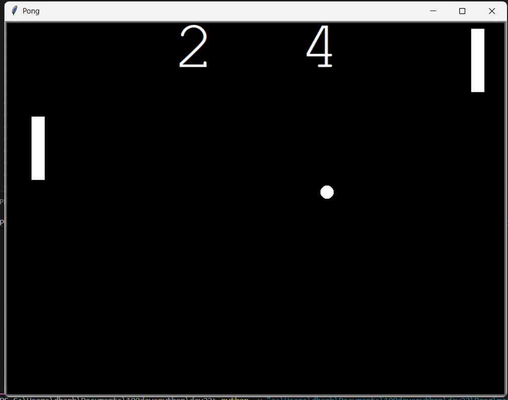

#  Pong Game

A classic two-player Pong game built using **Python Turtle Graphics** and **Object-Oriented Programming (OOP)**. Control the paddles, bounce the ball, and compete to achieve the highest score.

## 📸 Screenshot



## ✨ Features

* 🎮 Two-player gameplay
* 🏓 Smooth paddle movement
* ⚽ Ball collision detection
* 📊 Live scoreboard
* ⚡ Ball speed increases after each paddle hit
* 🧱 Wall bounce mechanics
* 🔄 Automatic ball reset after a point

## 🎮 Controls

| Player       | Controls                 |
| ------------ | ------------------------ |
| Left Player  | **W** (Up), **S** (Down) |
| Right Player | **↑** (Up), **↓** (Down) |

## 🛠️ Technologies Used

* Python 3
* Turtle Graphics
* Object-Oriented Programming (OOP)

## 📂 Project Structure

```text
pong-game-python/
│── main.py
│── Paddle.py
│── Ball.py
│── score.py
│── pong_image.png
└── README.md
```

## ▶️ How to Run


   ```bash
   python main.py
   ```


## 👨‍💻 Author

**Biswajit Dhar**

If you found this project useful, consider giving it a ⭐ on GitHub!
